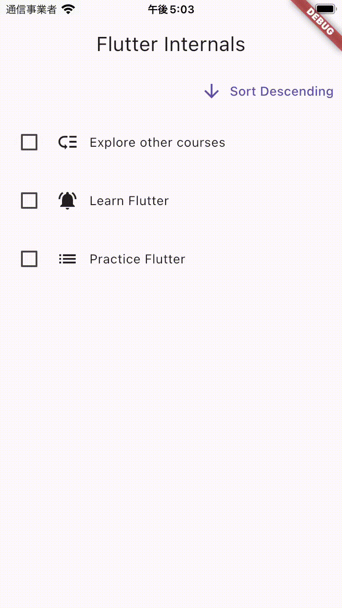

# TODO APP

About Flutter management of various trees to update the UI efficiently, about setting up keys for StateFullWidget's state management, etc

Section7 : [Flutter & Dart - The Complete Guide：2023 Edition](https://www.udemy.com/course/learn-flutter-dart-to-build-ios-android-apps/)

## Demo

